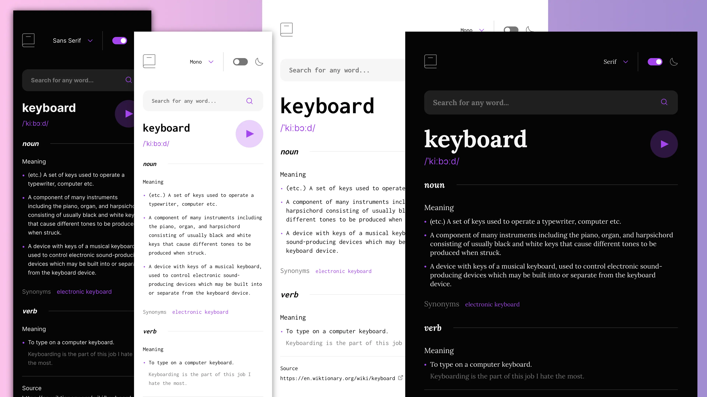

# Dictionary Web App - Frontend Mentor Challenge



It appears that the project you're trying to run uses Vite as its build tool and development server. Here are the steps to run the project on your localhost:

1. **Clone the Repository:**

   ```sh
   git clone https://github.com/Mujib7654/LexiVerse-Dictionary-App.git
   ```

2. **Install Dependencies:**
   Install the project's dependencies using npm:

   ```sh
   npm install
   ```

3. **Run the Development Server:**
   To start the development server, use the following command:

   ```sh
   npm start
   ```

   This command will run Vite's development server, and the application will be accessible at a local URL, usually `http://localhost:8080` or a similar port.

   Alternatively, you can use the specific `preview` script:

   ```sh
   npm run
   ```

   This will also start the development server.

4. **Access the Application:**
   Open your web browser and navigate to the local URL where the development server is running (e.g., `http://localhost:8080`). You should be able to see and interact with the web application.
